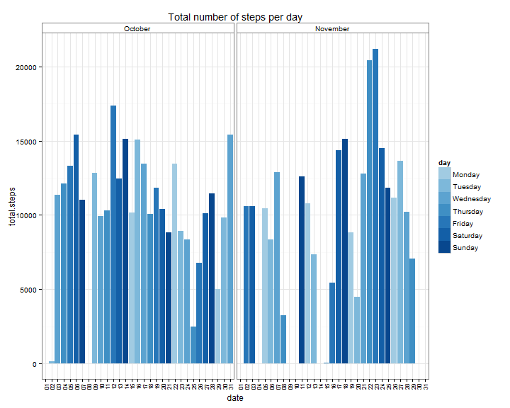
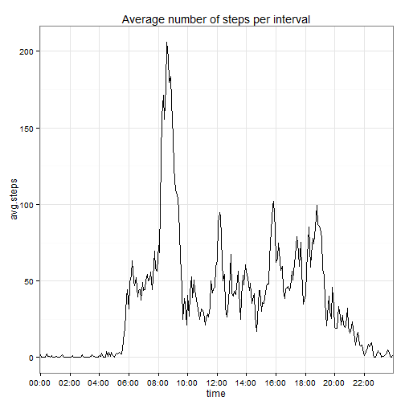
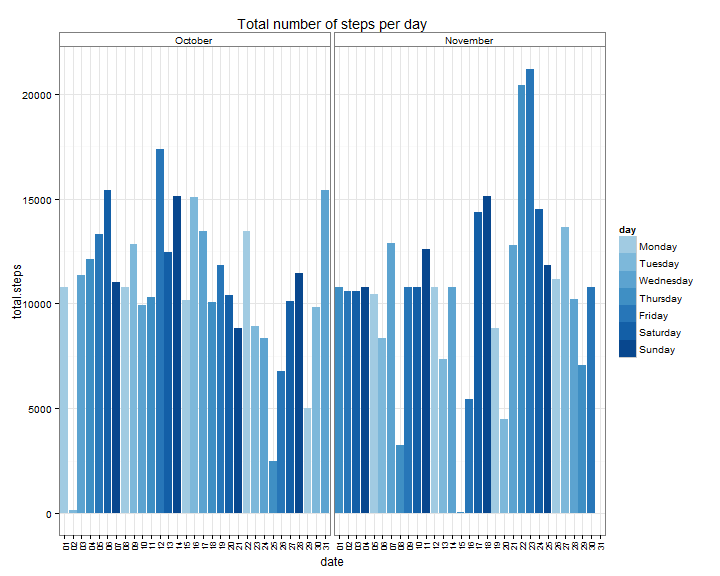
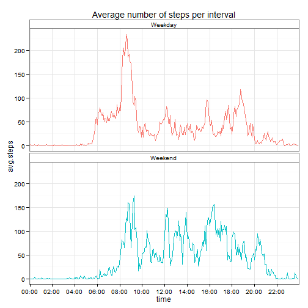

# Reproducible Research: Peer Assessment 1


## Loading and preprocessing the data

The data was loaded:


```r
data <- read.csv("./activity.csv")
```

## What is mean total number of steps taken per day?

To find the total number of steps per day, the function ddply() from the plyr package is used to summarise the data:


```r
library("plyr")
total.steps <- ddply(data, .(date), summarise, total.steps = sum(steps))
```

For plotting two additional factors are added, one for months and another for days of the week:


```r
total.steps$month <- months(as.POSIXlt(total.steps$date))
total.steps$month <- factor(total.steps$month, levels = c("October", "November"))
total.steps$day <- weekdays(as.POSIXlt(total.steps$date))
total.steps$day <- factor(total.steps$day, levels = c("Monday", "Tuesday", "Wednesday", 
                                                        "Thursday", "Friday", "Saturday", 
                                                      "Sunday"))
```

A barplot of the data is created with ggplot, bar colours generated with functions from the RColorBrewer package:


```r
total.steps$date <- gsub("^(.*)-", "", total.steps$date)

library("RColorBrewer")
blues <- colorRampPalette(brewer.pal(9,"Blues"))(12)

library("ggplot2")
hist1 <- ggplot(total.steps, aes(x = date, y = total.steps, facets = month, fill = day)) + 
    geom_bar(stat = "identity") + facet_grid(. ~ month) + theme_bw() + labs(title = "Total number of steps per day") + scale_fill_manual(values = blues[5:12])
hist1 + theme(axis.text.x = element_text(angle = 90, vjust = 0.5, size = 8), 
              strip.background = element_rect(fill = c("white")))
```

 

The mean and median of the data were calculated:


```r
mean(total.steps$total.steps, na.rm = T)
```

```
## [1] 10766
```

```r
median(total.steps$total.steps, na.rm = T)
```

```
## [1] 10765
```
  
  
## What is the average daily activity pattern?

The data was summarised per interval and then the mean number of steps per interval was calculated:


```r
avg.steps <- ddply(data, .(interval), summarise, avg.steps = mean(steps, na.rm = T))
```

Some additional processing was carried out for plotting, intervals were converted into character strings that represented a 24 hour format, "00:00":


```r
avg.steps$time <- sprintf("%04d", avg.steps$interval)
avg.steps$time <- gsub("^([0-9]{2})([0-9]{2})$", "\\1:\\2", avg.steps$time)
avg.steps$group = c("g1") # Need to add a dummy group for plotting in ggplot
```

A line plot was created:


```r
x.breaks <- seq(1, 288, by = 24)
plot1 <- ggplot(avg.steps, aes(x = time, y = avg.steps, group = group)) + geom_line() +
            theme_bw() + labs(title = "Average number of steps per interval")
plot1 + scale_x_discrete(breaks = avg.steps$time[x.breaks], 
                         labels = avg.steps$time[x.breaks])
```

 

The interval with the maximum number of steps was found:


```r
avg.steps$time[which.max(avg.steps$avg.steps)]
```

```
## [1] "08:35"
```

The interval from 08:35 to 08:40.
  

## Imputing missing values
Count the number of "NA" in the data:

```r
sum(is.na(data$steps))
```

```
## [1] 2304
```

Impute strategy, replace the NA's with the mean value for that particular interval:


```r
impute.values <- ddply(data, .(interval), summarise, mean = mean(steps, na.rm = T))
impute <- function(x, y){
    if(is.na(x)){
        x <- impute.values$mean[which(impute.values$interval == y)]
    }
    return(x)
}
data1 <- data
data1$steps <- mapply(impute, data$steps, data$interval)
```

The data was summarised and the total number of steps calculated. Two addtional factors were added to the dataframe, one for months and another for days of the week:


```r
total.steps1 <- ddply(data1, .(date), summarise, total.steps = sum(steps))
total.steps1$month <- months(as.POSIXlt(total.steps1$date))
total.steps1$month <- factor(total.steps1$month, levels = c("October", "November"))
total.steps1$day <- weekdays(as.POSIXlt(total.steps1$date))
total.steps1$day <- factor(total.steps1$day, levels = c("Monday", "Tuesday", "Wednesday", 
                                                        "Thursday", "Friday", "Saturday", 
                                                      "Sunday"))
```

A barplot of the data was made:


```r
total.steps1$date <- gsub("^(.*)-", "", total.steps1$date)
hist2 <- ggplot(total.steps1, aes(x = date, y = total.steps, facets = month, fill = day)) + 
    geom_bar(stat = "identity") + facet_grid(. ~ month) + theme_bw() + 
    labs(title = "Total number of steps per day") + scale_fill_manual(values = blues[5:12])
hist2 + theme(axis.text.x = element_text(angle = 90, vjust = 0.5, size = 8), 
              strip.background = element_rect(fill = c("white")))
```

 

Recalculate the mean and median for the new dataframe with imputed values:


```r
mean(total.steps1$total.steps, na.rm = T)
```

```
## [1] 10766
```

```r
median(total.steps1$total.steps, na.rm = T)
```

```
## [1] 10766
```


## Are there differences in activity patterns between weekdays and weekends?

Reworked the impute function to also group by weekend/weekday classification:


```r
data2 <- data
data2$date <- as.POSIXlt(data2$date)
data2$day <- weekdays(data2$date)

data2$w <- ifelse(data2$day %in% c("Saturday", "Sunday"), "Weekend", "Weekday")

impute.values2 <- ddply(data2, .(interval, w), summarise, mean = mean(steps, na.rm = T))
impute <- function(x, y, z){
    if(is.na(x)){
        x <- impute.values2$mean[which(impute.values2$interval == y &
                                          impute.values2$w == z)]
    }
    return(x)
}

data2$steps <- mapply(impute, data2$steps, data2$interval, data2$w)
```

Ddply() was used to find the mean number of steps per interval and further grouped by weekend/weekday:


```r
avg.steps2 <- ddply(data2, .(w, interval), summarise, avg.steps = mean(steps, na.rm = T))
```

Made legible labels:


```r
avg.steps2$time <- sprintf("%04d", avg.steps2$interval)
avg.steps2$time <- gsub("^([0-9]{2})([0-9]{2})$", "\\1:\\2", avg.steps2$time)
```

Repeated the code to make a line plot of the data split by weekday/weekend:


```r
x.breaks <- seq(1, 288, by = 24)
plot2 <- ggplot(avg.steps2, aes(x = time, y = avg.steps, group = w, colour = w, 
                                 facets = w)) + geom_line() + 
            facet_wrap(~ w, ncol = 1) + theme_bw() + 
            labs(title = "Average number of steps per interval")

plot2 + scale_x_discrete(breaks = avg.steps2$time[x.breaks], 
                         labels = avg.steps2$time[x.breaks]) + 
        theme(legend.position = "none", strip.background = element_rect(fill = c("white")))
```

 
  
Noticeable peak observed only in the weekday data, this peak occurs between 08:00 and 09:00, suggesting travelling to work.
